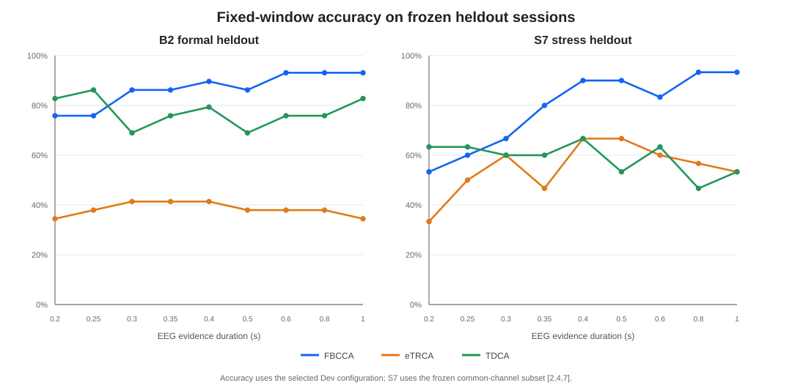
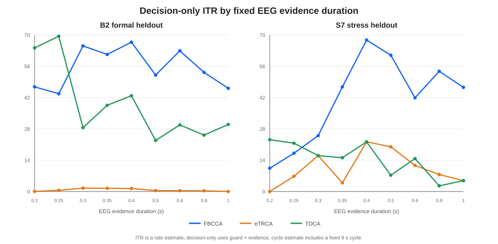
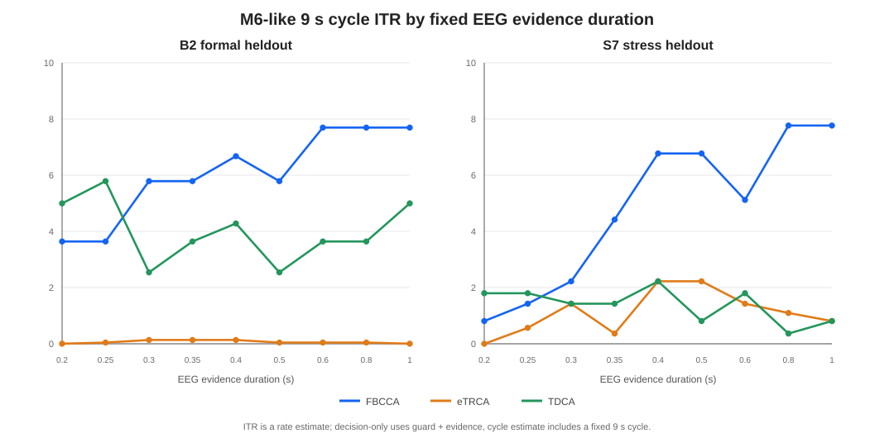
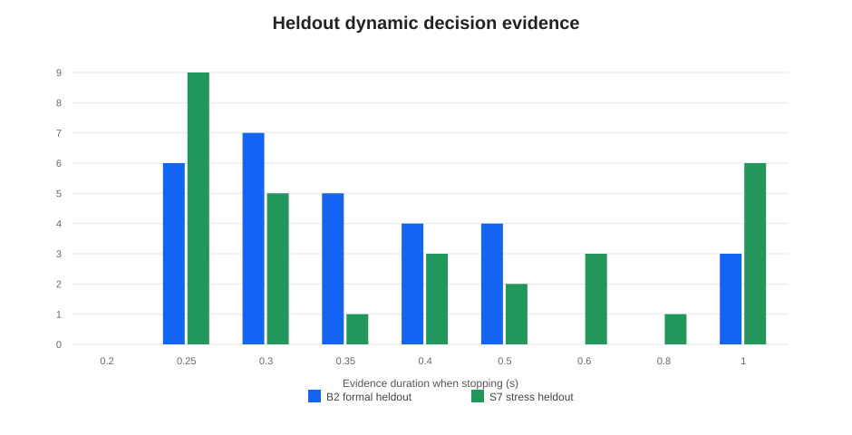
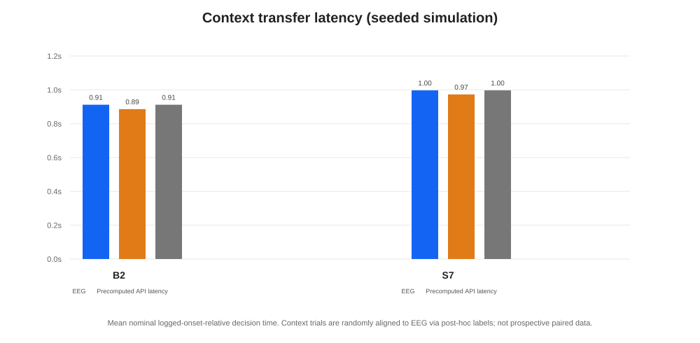
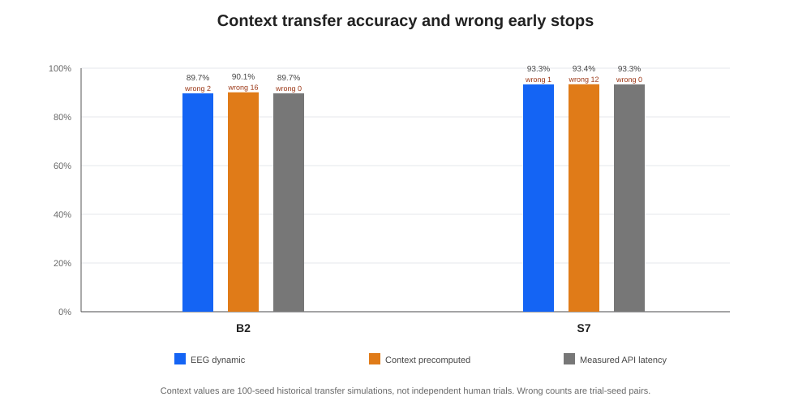

# M34 Final Report — High-Speed SSVEP and Context-Enhanced Dynamic Stopping

Date: 2026-10-04 (Asia/Shanghai)
Evaluation: software-only historical EEG analysis; no Quest, ND8, COM11, live EEG, robot, or MuJoCo operation.

## Executive result

The strongest decoder selected on the frozen development session was the existing three-band FBCCA (`FBCCA-003`, channels `[2,3,4,5,7]`, three harmonics). On the primary heldout session B2 it reached 89.7% at 0.40 s evidence and 93.1% at 0.60 s; the separate S7 stress session reached 90.0% at 0.40/0.50 s and 93.3% at 0.80 s. Neither session reached 95% on the tested windows. The DEV-frozen dynamic policy averaged 0.412 s EEG evidence on B2 and 0.497 s on S7, with 89.7% and 93.3% accuracy respectively. These results do not support a high-reliability 300–500 ms claim.

Context moved some seeded historical transfer pairs into the 200–300 ms evidence range, but it produced 28 wrong early stops across 5,900 trial-seed pairs. Its aggregate accuracy did not fall in this simulation, yet the nonzero wrong stops fail the frozen safety objective. Context therefore is not ready to authorize early stopping in deployment. The analysis and reproducible software pipeline are complete; proving better reliability now requires new, prospective EEG with independently held-out sessions and real paired Context history.

## Data audit and compatibility

The audit found 118 usable waveform trials in four sessions. The primary formal cohort is A+B1+B2 (88 trials); S7 is a separate 30-trial M6.7 stress cohort and is not pooled into primary accuracy. The source manifests do not include participant IDs. Same-participant status follows acquisition history and cannot be independently verified from these files.

| Session | Role | Usable | Left / center / right | Channels used | Rate | Raw samples/channel | Fixed exclusion |
|---|---|---:|---:|---|---:|---:|---|
| A (`m6_1b`) | Train | 30 | 10 / 10 / 10 | 2, 3, 4, 5, 7 | 1000 Hz | 417,400 | none |
| B1 (`m6_4`) | Dev | 29 | 10 / 9 / 10 | 2, 3, 4, 5, 7 | 1000 Hz | 404,400 | trial 011: stale clock-sync freshness |
| B2 (`m6_4`) | Primary heldout | 29 | 10 / 10 / 9 | 2, 3, 4, 5, 7 | 1000 Hz | 466,000 | trial 023: frozen M25 formal-88 boundary |
| S7 (`m6_7`) | Separate stress heldout | 30 | 10 / 10 / 10 | 2, 4, 7 | 1000 Hz | 655,000 | none |

Slot mapping stayed fixed: slot 0 = 7.2 Hz, slot 1 = 9 Hz, slot 2 = 12 Hz. A/B1/B2 share nominal frequency mapping, sampling rate, raw packet shape, nominal stimulus duration, and software onset convention. They differ in session and task state, and their original source manifests are not equally complete. S7 has a different three-channel usability set and stress-online task state, so it remains separate. The cohorts are compatible for the stated session-aware subject-specific analysis, not for an unqualified pooled/generalization claim.

Raw source files remained at their original `D:\EEG_Study` paths and were not copied into the repository. Fresh read-only SHA-256 checks at final audit match both the frozen manifest and the before/after hashes recorded for the heldout run; see [final_audit.json](final_audit.json). The data and trial-level provenance are in [data_manifest.json](data_manifest.json) and [data_manifest.csv](data_manifest.csv).

Other discovered material was not treated as formal three-class waveforms: M6.1a contains signal/channel sanity sessions, M6.6b contains incomplete diagnostic payloads, and two earlier M6.7 attempts have continuity/channel failures. Their paths and exclusion reasons are listed in the manifest; no source data were removed.

## Frozen evaluation and baseline

The frozen split is A=train (30), B1=dev (29), B2=primary heldout (29), and S7=separate stress heldout (30). Trials are indivisible; all evidence windows for a trial stay in its session split. During search, supervised model statistics use A only. B1 selects configurations, preprocessing, onset guard, and stopping thresholds. Final eTRCA/TDCA templates are refit on A+B1 only after freeze. B2 and S7 were evaluated once after freeze; their results were not used for retuning. These data had prior historical use in M6 and M21–M25 analyses, and S7 has a previously reported long-window stress result, so “heldout” means held out from M34 model selection, not historically untouched.

The existing NumPy FBCCA baseline was reproduced on A and B1 at 1.5 s evidence with a 0.5 s guard: A 30/30 and B1 28/29, both matching the recorded M6 fixed-window accuracy exactly. The baseline uses 1000 Hz raw samples, per-channel de-meaning, three harmonics, the existing three-band raised-cosine filter bank/weights, and channels `[2,3,4,5,7]`.

The supplementary training-session leave-one-trial-out check on A was 20/30, 23/30, and 30/30 for FBCCA at 0.30/0.50/1.00 s; 22/30, 22/30, and 23/30 for eTRCA; and 16/30, 25/30, and 29/30 for TDCA. It was not used to select M34 parameters. A-to-B1 is cross-session development; the final B2 evaluation uses models refit on A+B1 and is cross-session. S7 is a separate stress-condition transfer. No pooled score combines training, development, and heldout trials.

Onset guard candidates were 0.10/0.15/0.20/0.25/0.30/0.40/0.50 s. The frozen rule selected 0.50 s because it gave the highest B1 mean balanced accuracy across 0.30/0.40/0.50 s windows. The onset is the Quest `stimulus_started_software` event mapped to an estimated ND8 global sample index. Median mapping uncertainty by session was 27.83 ms (A), 29.28 ms (B1), 26.91 ms (B2), and 22.62 ms (S7). Physical optical onset, hardware sample anchoring, and hardware-exact timing remain unverified. All onset-relative times below are therefore **nominal logged-onset-relative** times.

The bounded A/B1 search recorded 116 configurations and 1,044 configuration/window metrics. Selected Dev configurations were:

| Decoder | Selected configuration | B1 mean balanced accuracy at 0.30/0.40/0.50 s |
|---|---|---:|
| FBCCA | 5 channels `[2,3,4,5,7]`, three bands, H=3 | 85.93% |
| eTRCA | 5 channels, three bands, 2 components/class | 58.40% |
| TDCA | 5 channels, demean-only, H=3, 6 delays × 4 samples, 2 components, ridge 0.01 | 64.44% |

FBCCA was chosen by the predeclared B1 rule. TDCA was stronger than FBCCA at B2/0.20 s, but heldout performance cannot change the chosen decoder or its operating point. The ensemble TRCA and TDCA implementations follow their cited task-related calibration methods; poor transfer is a result, not a reason to modify the algorithms after heldout.

## Fixed-window results

Each cell is correct/total (accuracy). Timing is 0.50 s guard plus the EEG evidence duration. Full nine-window per-class accuracy, confusion matrices, ITR, fit time, and compute latency for all decoders are in [heldout_fixed_summary.csv](heldout_fixed_summary.csv) and [heldout_fixed_per_trial.csv](heldout_fixed_per_trial.csv).

| Evidence | B2 FBCCA | B2 eTRCA | B2 TDCA | S7 FBCCA | S7 eTRCA | S7 TDCA |
|---:|---:|---:|---:|---:|---:|---:|
| 0.20 s | 22/29 (75.9%) | 10/29 (34.5%) | 24/29 (82.8%) | 16/30 (53.3%) | 10/30 (33.3%) | 19/30 (63.3%) |
| 0.30 s | 25/29 (86.2%) | 12/29 (41.4%) | 20/29 (69.0%) | 20/30 (66.7%) | 18/30 (60.0%) | 18/30 (60.0%) |
| 0.40 s | 26/29 (89.7%) | 12/29 (41.4%) | 23/29 (79.3%) | 27/30 (90.0%) | 20/30 (66.7%) | 20/30 (66.7%) |
| 0.50 s | 25/29 (86.2%) | 11/29 (37.9%) | 20/29 (69.0%) | 27/30 (90.0%) | 20/30 (66.7%) | 16/30 (53.3%) |

Among fixed FBCCA windows, the shortest window matching each session’s best observed accuracy was 0.60 s for B2 (27/29, 93.1%; 0.80 and 1.00 s also reached 93.1%) and 0.80 s for S7 (28/30, 93.3%; 1.00 s also reached 93.3%). Those values remain below 95%. At 0.40 s the selected decoder gave about 90% in each session, which is a useful short-window result but not high-reliability evidence under the preferred 95% target.

Selected FBCCA compute time at 0.40 s was 2.97 ms mean / 4.31 ms p90 on B2 and 2.35 ms / 2.73 ms on S7. Compute time is reported separately from evidence collection and nominal decision time. The fixed result files include all nine windows (0.20 through 1.00 s), all decoder/session combinations, per-class results, confusion matrices, and both ITR estimates.

ITR uses the standard three-class information term `B = log2(3) + p log2(p) + (1-p) log2((1-p)/2)` and `ITR = B × 60/T`. Decision-only `T` is nominal onset-relative guard plus evidence. The separately labelled M6-like cycle uses a fixed 9 s assumption (2 s cue + 1 s pre-stimulus rest + 4 s stimulation + 2 s post-stimulus rest). These are rate estimates, not measured online throughput.

## Dynamic stopping

The selected B1-only policy is `E200_M175_S2`: evidence starts at 0.20 s, relative top-vs-second margin must be at least 0.175, the top class must remain stable for two consecutive updates, and evidence is capped at 1.00 s. On B1 it scored 28/29 (96.55%), with zero wrong early stops; mean evidence was 0.486 s and mean nominal onset-relative time was 0.986 s. The frozen guard is 0.50 s.

| Heldout | Accuracy | Evidence mean / median / p90 | Nominal time mean / median / p90 | Compute mean / p90 per stop | Cumulative repeated recompute mean / p90 | Wrong early | At max window |
|---|---:|---:|---:|---:|---:|---:|---:|
| B2 (n=29) | 26/29 (89.66%) | 0.412 / 0.350 / 0.600 s | 0.912 / 0.850 / 1.100 s | 2.51 / 3.12 ms | 11.23 / 17.96 ms | 2 | 3 |
| S7 (n=30) | 28/30 (93.33%) | 0.497 / 0.375 / 1.000 s | 0.997 / 0.875 / 1.500 s | 2.43 / 3.02 ms | 12.18 / 22.19 ms | 1 | 6 |

The maximum-window counts are observations from the heldout trace; they do not alter the frozen policy. At or before 0.30 s evidence, 13/29 B2 trials (44.8%) and 14/30 S7 trials (46.7%) stopped. At or before 0.40 s: 22/29 (75.9%) and 18/30 (60.0%). At or before 0.50 s: 26/29 (89.7%) and 20/30 (66.7%). No trial stopped at 0.20 s. B2 dynamic ITR was 65.90 bits/min decision-only and 6.68 bits/min using the fixed 9 s cycle; S7 was 70.13 and 7.77 bits/min respectively.

`computeMs` is the time for the decoder update at the selected stop. “Cumulative repeated recompute” sums the observed full-window recomputations across preceding update steps; it is a conservative replay estimate, not a measured incremental streaming implementation. The per-trial outcomes and dynamic summary are in [heldout_dynamic_per_trial.csv](heldout_dynamic_per_trial.csv) and [heldout_results.json](heldout_results.json).

## M33 Context transfer simulation

Context was integrated only after the EEG decoder and stop policy were frozen. The M33 train/dev gate threshold remained 0.3039226. The M34 Context gates require an informative, non-ambiguous M33 result; safe page projection with projected top mass and global page mass each at least 0.70; current Context top equal to the current raw EEG top; at least 0.20 s evidence, EEG relative margin at least 0.05, and two consecutive stable EEG top updates. An authorized stop emits the **current raw EEG top**; Context never reranks it. If authorization fails, output and stopping time fall back exactly to the EEG-only path.

The policy was tuned on B1 only (100 deterministic assignment seeds). It was selected from the bounded search with nonzero EEG margin, zero Dev wrong early stops, no delay, and no accuracy loss: 363/2,900 applications, zero wrong early stops, +0.0247 s mean paired gain. The measured-API-latency sensitivity authorized no applications. The frozen M33 gate and input provenance are hashed in [full_pipeline_freeze.json](full_pipeline_freeze.json).

The final Context result is a **seeded historical transfer simulation**, not prospective EEG/Context pairing. Historical M33 semantic outputs are assigned to each EEG trial using 100 deterministic seeds. A post-hoc expected-target label is used only to map the synthetic three-candidate page onto the EEG true slot; it is not passed to the Context model or decoder. Consequently, 2,900/3,000 simulated pairs are not independent human observations; the actual EEG sample sizes remain 29 and 30.

| Session / availability | EEG-only accuracy → Context | Mean nominal time | Median / p90 nominal time* | Gate authorization | Applied | Shifted from >0.30 to ≤0.30 s evidence | Wrong early / Context-caused errors | Exact EEG fallback |
|---|---:|---:|---:|---:|---:|---:|---:|---:|
| B2, precomputed | 89.66% → 90.10% (+0.45 pp) | 0.912 → 0.886 s | 0.85/1.50 → 0.80/1.00 s | 657/2,900 (22.66%) | 458/2,900 (15.79%) | 211/2,900 (7.28%) | 16 / 11 | 2,442/2,900 (84.21%) |
| S7, precomputed | 93.33% → 93.40% (+0.07 pp) | 0.997 → 0.973 s | 0.875/1.50 → 0.85/1.50 s | 700/3,000 (23.33%) | 333/3,000 (11.10%) | 55/3,000 (1.83%) | 12 / 12 | 2,667/3,000 (88.90%) |
| B2, measured API latency sensitivity | 89.66% → 89.66% (0 pp) | 0.912 → 0.912 s | 0.85/1.50 → 0.85/1.50 s | 0/2,900 | 0/2,900 | 0 | 0 / 0 | 2,900/2,900 (100%) |
| S7, measured API latency sensitivity | 93.33% → 93.33% (0 pp) | 0.997 → 0.997 s | 0.875/1.50 → 0.875/1.50 s | 0/3,000 | 0/3,000 | 0 | 0 / 0 | 3,000/3,000 (100%) |

*Context median/p90 are computed over 100 seeded pairings per heldout EEG trial. The repeated-pair p90 differs from the raw-trial dynamic p90 because repeated discrete stop times alter the percentile rank; it must not be read as 2,900 or 3,000 independent EEG trials.

Across precomputed scenarios, 266 of 5,900 trial-seed pairs were moved from an EEG-only stop later than 0.30 s to a Context-authorized raw-EEG stop at or before 0.30 s. Overall accuracy did not decrease in these simulations, and there were zero delay violations. However, the precomputed scenario produced 28 wrong early stops (23 classified as Context-caused errors) across the trial-seed pairs. Thus it does not meet the frozen zero-wrong-stop safety goal. The mean gain among applied pairs was 0.166 s on B2 and 0.214 s on S7. Under the measured M33 API latency sensitivity, there were no applications and exact EEG-only fallback for all 5,900 pairs.

For cumulative seeded pairs, decisions at or before 0.20 s evidence remained 0 on both sessions. B2 at or before 0.25 s increased from 600/2,900 (20.69%) to 891/2,900 (30.72%); at or before 0.30 s it increased from 1,300/2,900 (44.83%) to 1,511/2,900 (52.10%). S7 at or before 0.25 s increased from 900/3,000 (30.00%) to 1,057/3,000 (35.23%); at or before 0.30 s it increased from 1,400/3,000 (46.67%) to 1,455/3,000 (48.50%). These are repeated trial-seed pair proportions, not counts of independent EEG trials. The frozen M33 semantic source had 23/46 ambiguous/off/invalid rows; Context alignment fell back on 165/2,900 B2 pairs and 191/3,000 S7 pairs. Other fallback causes include insufficient agreement, margin, stability, page mass, or API availability.

The complete paired rows, including fallback reason, semantic gate/application flags, page mass, stop point, and correctness, are in [context_heldout_per_trial_seed.csv](context_heldout_per_trial_seed.csv); grouped summaries are in [heldout_context_summary.json](heldout_context_summary.json). The measured-API scenario is a sensitivity case, not a live latency measurement.

## Self-review, evidence limits, and conclusion

The result addresses the current-data question without weakening thresholds: FBCCA was selected using the frozen B1 criterion, the stopping policy was selected on B1, and B2/S7 were not revisited for tuning. The final runner records one completed heldout execution with no retry. The result supports an approximately 90% short-window FBCCA operating point around 0.40 s evidence on these sessions, but not a 95% reliability claim. Dynamic stopping reduces average EEG evidence to roughly 0.41–0.50 s but is still below 95% on both heldout sessions. Context demonstrates some simulated acceleration into 0.20–0.30 s, but its wrong early stops prevent a safety claim.

No additional software experiment can validly improve the reported heldout score: B2 and S7 have been consumed by the one-shot frozen evaluation. Selecting another decoder, guard, margin, Context gate, or threshold based on these outcomes would violate the protocol. The Dev-only Context search already tested the bounded evidence/margin/stability candidate grid; the remaining bottleneck is independent evidence, not an identified implementation failure.

**Verdict:**

- **Software bottleneck:** partially solved. Reproducible baseline, bounded decoder search, dynamic policy, Context transfer simulation, and machine audit are complete.
- **Current data support the target?** No high-reliability (≥95%) 300–500 ms EEG-only point was observed, and Context did not satisfy the zero-wrong-early-stop safety objective.
- **More EEG required?** Yes, for a paper-grade reliability or Context acceleration claim. Collect a preregistered prospective dataset with more trials per class over independent sessions and participants, actual prior-selection Context aligned online, and measured optical/hardware timing.
- **Next action:** new prospective acquisition with a frozen FBCCA/dynamic baseline; do not enable Context early stopping until independently validated at the chosen safety criterion.
- **Paper claim:** current data are not sufficient for generalized, physical-latency, or safe Context-acceleration claims. Results are useful as pilot, subject-specific historical evidence with explicit limitations.

## Reproducibility and verification

- Frozen protocol: [frozen_protocol.json](frozen_protocol.json)
- Dataset and exclusions: [data_manifest.json](data_manifest.json), [data_manifest.csv](data_manifest.csv)
- Baseline reproduction: [baseline_reproduction.json](baseline_reproduction.json), [baseline_reproduction_per_trial.csv](baseline_reproduction_per_trial.csv)
- All 116 Dev configurations / 1,044 window metrics: [train_dev_search_summary.csv](train_dev_search_summary.csv); the larger trial-level search table is retained locally as generated detail.
- Selected decoders / frozen EEG policy: [selected_eeg_backbones.json](selected_eeg_backbones.json), [full_pipeline_freeze.json](full_pipeline_freeze.json)
- Dynamic search and outputs: [dynamic_stopping_candidates.csv](dynamic_stopping_candidates.csv), [dynamic_stopping_summary.json](dynamic_stopping_summary.json), [heldout_dynamic_per_trial.csv](heldout_dynamic_per_trial.csv)
- Context Dev and heldout outputs: [context_dev_summary.json](context_dev_summary.json), [heldout_context_summary.json](heldout_context_summary.json), [context_heldout_per_trial_seed.csv](context_heldout_per_trial_seed.csv)
- One-shot heldout provenance: [heldout_attempt_complete.json](heldout_attempt_complete.json), [heldout_results.json](heldout_results.json)
- Final machine audit: [final_audit.json](final_audit.json), run with `python verify_m34_artifacts.py` from this directory. It checks split integrity, mapping, table counts, exact EEG fallback, Context gating in the production analysis path, plot outputs, and fresh raw-source hashes without writing to source EEG.

The experiment reused standard ensemble TRCA and TDCA references: [Nakanishi et al., 2018](https://pmc.ncbi.nlm.nih.gov/articles/PMC5783827/) and [Liu et al., 2021](https://bingchuanliu.github.io/assets/pdf/liu_tnsre.pdf). The analysis implementation is in [m34_decoders.py](m34_decoders.py); scripts, iteration history, and all tabular outputs are retained in this attempt directory. Python syntax compilation and the 29-check artifact audit passed.
